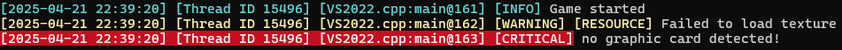
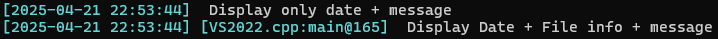

# OMLogger


**OMLogger** (One More Logger) is a single-header **logging library** for C++20, designed for clarity, flexibility, and ease of use.  
It supports **console and file outputs**, **verbosity filtering**, **color-coded messages**, **tag-based categorization**, and more — all with zero dependencies.



## Table of Contents
- [Features](#features)
- [Add to your project](#add-to-your-project)
- [Usage](#usage)
  - [Basic logging](#basic-logging)
  - [Verbosity levels](#verbosity-levels)
  - [Tags](#tags)
  - [Display Settings](#display-settings)
  - [File output](#file-output)
  - [Assertion](#assertion)
- [Requirements](#requirements)
- [Credit](#credit)

## Features
- Console output with **colored logs**
- Optional **file output**
- Configurable **verbosity levels**
- **Tag system** for filtering and categorizing logs
- **Assertion** macro with custom error messages
- Lightweight and **header-only**

## Add to your project  
Add the [`OMLogger/Logger.hpp`](./OMLogger/Logger.hpp) file to your project and include it where needed.  
```cpp
#include "OMLogger/Logger.hpp"
```   
There are no external dependencies.

## Usage

### Basic logging
Use the macros to log your messages:
```cpp
int main()
{
	OM_LOG_DEBUG("your text here");
	OM_LOG_INFO("your text here");
	OM_LOG_WARNING("your text here");
	OM_LOG_ERROR("your text here");
	OM_LOG_CRITICAL("your text here");

	OM::Logger::Logger::GetInstance()->Destroy(); // Important!
}
```

### Verbosity Levels
Use the `SetVerbosity()` method to filter log messages:
```cpp
int main()
{
	OM::Logger::Logger::GetInstance()->SetVerbosity(OM::Logger::VerbosityDebug | OM::Logger::VerbosityInfo);
	OM_LOG_DEBUG("Only debug and info verbosity");   // Displayed
	OM_LOG_INFO("Only debug and info verbosity");    // Displayed 
	OM_LOG_WARNING("Only debug and info verbosity"); // Not displayed
	OM_LOG_ERROR("Only debug and info verbosity");   // Not displayed
	OM_LOG_CRITICAL("Only debug and info verbosity"); // Not displayed
}
```

### Tags
Use the macros to log and tag your messages:
```cpp
int main()
{
	OM_LOG_INFO_TAG("your text here", OM::Logger::TagCore);
}
```

### Display Settings
Use the `SetDisplaySettings()` method to configure what log information is shown:
```cpp
int main()
{
	OM::Logger::Logger::GetInstance()->SetDisplaySettings(OM::Logger::DisplayDate);
	OM_LOG_INFO("Displays only date + message");

	OM::Logger::Logger::GetInstance()->SetDisplaySettings(OM::Logger::DisplayDate | OM::Logger::DisplayFileInfo);
	OM_LOG_INFO("Displays date + file info + message");
}
```

Result:  


### File Output
Use the `OpenLogFile()` and `CloseLogFile()` methods to enable or disable file output:
```cpp
int main()
{
	// Beginning of the project
	OM::Logger::Logger* logger = OM::Logger::Logger::GetInstance();
	logger->OpenLogFile("log.txt");

	OM_LOG_DEBUG("Message written to console and log file");

	// End of the project
	logger->CloseLogFile();
}
```

### Assertion
Use the `OM_ASSERTION` macro to assert your code:
```cpp
int main()
{
	// If _DEBUG is defined: logs a critical message + triggers a breakpoint
	// Else: logs a critical message + aborts

	OM_ASSERTION(1 + 1 == 2, "your text here"); // Passes
	OM_ASSERTION(1 + 1 == 3, "your text here"); // Fails
}
```

## Requirements
- **C++20**
- Windows OS *(for console color support via WinAPI)*

## Credit
Made by: [Vincent DEVINE](https://github.com/Vincent-Devine)