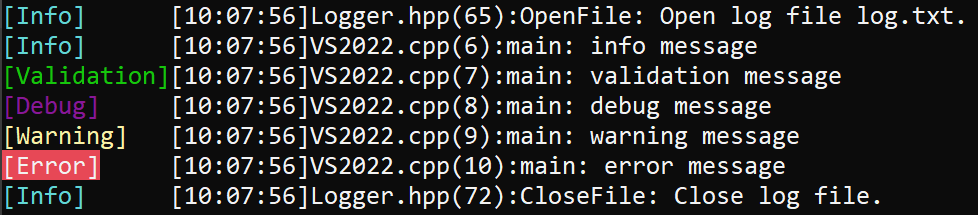

# OMLog 
One More Logger is a single-file **logging library** written in C++ that supports both console and file outputs

## Table of Content
- [Add to your project](#add-to-your-project)
- [Functionnality](#functionnality)
- [Requirement](#requirement)
- [Credit](#credit)

## Add to your project
Add ```OMLogger folder``` in your project

## Functionnality
### Write log on file
```cpp
#include "OMLogger/Logger.hpp"

// Start of your program
OM::Logger::OpenFile("Log.txt");

// ...

// End of your program
OM::Logger::CloseFile();
```

### Logging
Call macro ```LOG_INFO```, ```LOG_DEBUG```, ```LOG_WARNING``` or ```LOG_ERROR``` to write your log to the console and your file (if you've opened it before).<br>
The log message is preceded by the log level, the time, the file, the line and the function in which th log was called.
```cpp
#include "OMLogger/Logger.hpp"

int main()
{
	LOG_INFO("info message");
	LOG_DEBUG("debug message");
	LOG_WARNING("warning message");
	LOG_ERROR("error message");
}
```

Result *console*: <br>


### Assertion
```cpp
#include "OMLogger/Logger.hpp"

Assertion(0 == 1, "No, 0 == 0");
```

## Requirement
- C++ 20
- Windows OS

## Credit
Vincent DEVINE